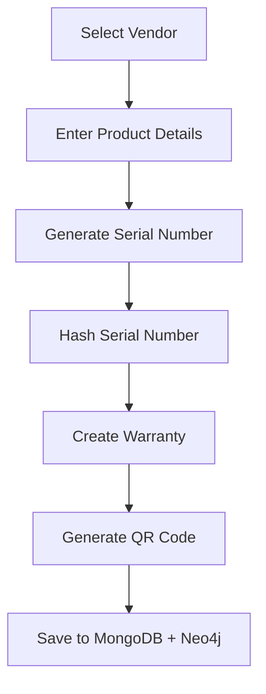
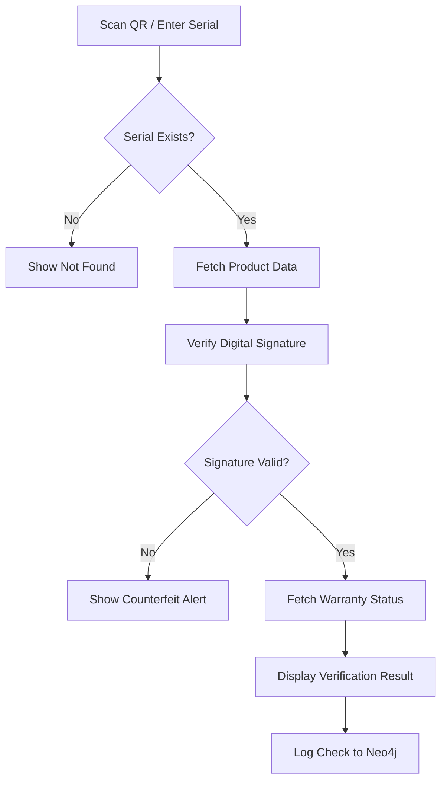
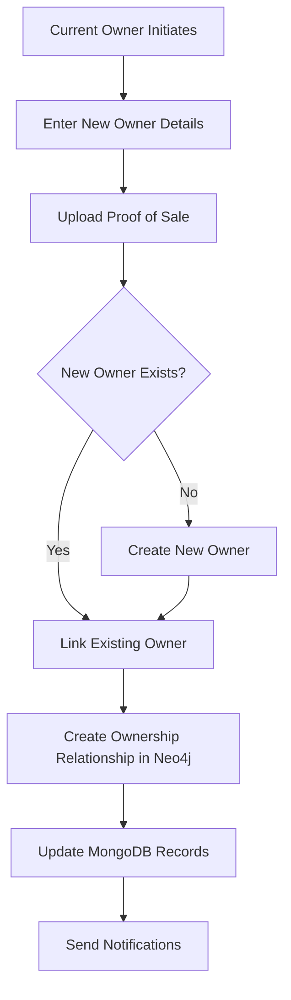

# Frontend Implementation Plan
## Digital Warranty Vault & Product Authenticity Verification System

---

## 1. Overview

This document outlines the complete frontend implementation strategy for the Digital Warranty Vault System using **React.js** with modern best practices. The frontend will provide an intuitive, visually stunning interface for managing product warranties, verifying authenticity, and tracking ownership history.

---

## 2. Technology Stack

| Category | Technology | Justification |
|----------|------------|---------------|
| **Framework** | React 18+ with Vite | Fast HMR, optimized builds, modern tooling |
| **Language** | TypeScript | Type safety, better IDE support, fewer runtime errors |
| **Routing** | React Router v6 | Industry standard, nested routes, lazy loading |
| **State Management** | Zustand + React Query | Lightweight global state + server state caching |
| **Styling** | Vanilla CSS + CSS Modules | Full control, no framework overhead |
| **HTTP Client** | Axios | Request interceptors, error handling |
| **Forms** | React Hook Form + Zod | Performant forms with schema validation |
| **UI Components** | Custom components | Premium, cohesive design system |
| **Charts** | Recharts | Lightweight, React-native charts |
| **Icons** | Lucide React | Consistent, modern icon set |
| **Date Handling** | date-fns | Lightweight date utilities |

---

## 3. Project Structure

```
frontend/
├── public/
│   ├── favicon.ico
│   └── assets/
│       └── images/
├── src/
│   ├── api/                    # API service layer
│   │   ├── axios.ts            # Axios instance configuration
│   │   ├── vendors.api.ts
│   │   ├── products.api.ts
│   │   ├── warranties.api.ts
│   │   ├── owners.api.ts
│   │   ├── authenticity.api.ts
│   │   └── auth.api.ts
│   │
│   ├── components/             # Reusable UI components
│   │   ├── common/
│   │   │   ├── Button/
│   │   │   ├── Card/
│   │   │   ├── Modal/
│   │   │   ├── Table/
│   │   │   ├── Input/
│   │   │   ├── Select/
│   │   │   ├── Badge/
│   │   │   ├── Loader/
│   │   │   ├── Toast/
│   │   │   └── Tooltip/
│   │   ├── layout/
│   │   │   ├── Sidebar/
│   │   │   ├── Header/
│   │   │   ├── Footer/
│   │   │   └── PageWrapper/
│   │   ├── charts/
│   │   │   ├── WarrantyStatusChart/
│   │   │   ├── ClaimsTimelineChart/
│   │   │   └── AuthenticityStatsChart/
│   │   └── domain/
│   │       ├── VendorCard/
│   │       ├── ProductCard/
│   │       ├── WarrantyCard/
│   │       ├── OwnershipTimeline/
│   │       ├── AuthenticityBadge/
│   │       └── QRScanner/
│   │
│   ├── hooks/                  # Custom React hooks
│   │   ├── useAuth.ts
│   │   ├── useVendors.ts
│   │   ├── useProducts.ts
│   │   ├── useWarranties.ts
│   │   ├── useOwnership.ts
│   │   ├── useAuthenticity.ts
│   │   └── useDebounce.ts
│   │
│   ├── pages/                  # Page components
│   │   ├── Dashboard/
│   │   ├── Auth/
│   │   │   ├── Login/
│   │   │   └── Register/
│   │   ├── Vendors/
│   │   │   ├── VendorList/
│   │   │   ├── VendorDetail/
│   │   │   └── VendorForm/
│   │   ├── Products/
│   │   │   ├── ProductList/
│   │   │   ├── ProductDetail/
│   │   │   └── ProductForm/
│   │   ├── Warranties/
│   │   │   ├── WarrantyList/
│   │   │   ├── WarrantyDetail/
│   │   │   └── WarrantyForm/
│   │   ├── Owners/
│   │   │   ├── OwnerList/
│   │   │   ├── OwnerDetail/
│   │   │   └── OwnerForm/
│   │   ├── Authenticity/
│   │   │   ├── VerificationPortal/
│   │   │   ├── CheckHistory/
│   │   │   └── ScanProduct/
│   │   ├── Ownership/
│   │   │   ├── OwnershipHistory/
│   │   │   └── TransferOwnership/
│   │   └── NotFound/
│   │
│   ├── store/                  # Global state management
│   │   ├── authStore.ts
│   │   ├── uiStore.ts
│   │   └── index.ts
│   │
│   ├── styles/                 # Global styles & design tokens
│   │   ├── globals.css
│   │   ├── variables.css
│   │   ├── typography.css
│   │   ├── animations.css
│   │   └── utilities.css
│   │
│   ├── types/                  # TypeScript type definitions
│   │   ├── vendor.types.ts
│   │   ├── product.types.ts
│   │   ├── warranty.types.ts
│   │   ├── owner.types.ts
│   │   ├── authenticity.types.ts
│   │   └── api.types.ts
│   │
│   ├── utils/                  # Utility functions
│   │   ├── formatters.ts
│   │   ├── validators.ts
│   │   ├── crypto.ts
│   │   └── constants.ts
│   │
│   ├── App.tsx
│   ├── main.tsx
│   └── vite-env.d.ts
│
├── .env.example
├── .eslintrc.cjs
├── .prettierrc
├── index.html
├── package.json
├── tsconfig.json
└── vite.config.ts
```

---

## 4. Design System

### 4.1 Color Palette

```css
:root {
  /* Primary Colors - Deep Blue/Indigo Theme */
  --primary-50: #eef2ff;
  --primary-100: #e0e7ff;
  --primary-200: #c7d2fe;
  --primary-300: #a5b4fc;
  --primary-400: #818cf8;
  --primary-500: #6366f1;
  --primary-600: #4f46e5;
  --primary-700: #4338ca;
  --primary-800: #3730a3;
  --primary-900: #312e81;
  
  /* Success - Emerald */
  --success-50: #ecfdf5;
  --success-500: #10b981;
  --success-600: #059669;
  
  /* Warning - Amber */
  --warning-50: #fffbeb;
  --warning-500: #f59e0b;
  --warning-600: #d97706;
  
  /* Error - Rose */
  --error-50: #fff1f2;
  --error-500: #f43f5e;
  --error-600: #e11d48;
  
  /* Neutral - Slate */
  --neutral-50: #f8fafc;
  --neutral-100: #f1f5f9;
  --neutral-200: #e2e8f0;
  --neutral-300: #cbd5e1;
  --neutral-400: #94a3b8;
  --neutral-500: #64748b;
  --neutral-600: #475569;
  --neutral-700: #334155;
  --neutral-800: #1e293b;
  --neutral-900: #0f172a;
  
  /* Gradients */
  --gradient-primary: linear-gradient(135deg, #667eea 0%, #764ba2 100%);
  --gradient-success: linear-gradient(135deg, #11998e 0%, #38ef7d 100%);
  --gradient-dark: linear-gradient(135deg, #1e293b 0%, #0f172a 100%);
}
```

### 4.2 Typography

```css
:root {
  --font-family-sans: 'Inter', -apple-system, BlinkMacSystemFont, sans-serif;
  --font-family-mono: 'JetBrains Mono', monospace;
  
  --font-size-xs: 0.75rem;    /* 12px */
  --font-size-sm: 0.875rem;   /* 14px */
  --font-size-base: 1rem;     /* 16px */
  --font-size-lg: 1.125rem;   /* 18px */
  --font-size-xl: 1.25rem;    /* 20px */
  --font-size-2xl: 1.5rem;    /* 24px */
  --font-size-3xl: 1.875rem;  /* 30px */
  --font-size-4xl: 2.25rem;   /* 36px */
  
  --font-weight-normal: 400;
  --font-weight-medium: 500;
  --font-weight-semibold: 600;
  --font-weight-bold: 700;
  
  --line-height-tight: 1.25;
  --line-height-normal: 1.5;
  --line-height-relaxed: 1.75;
}
```

### 4.3 Spacing & Sizing

```css
:root {
  --spacing-1: 0.25rem;   /* 4px */
  --spacing-2: 0.5rem;    /* 8px */
  --spacing-3: 0.75rem;   /* 12px */
  --spacing-4: 1rem;      /* 16px */
  --spacing-5: 1.25rem;   /* 20px */
  --spacing-6: 1.5rem;    /* 24px */
  --spacing-8: 2rem;      /* 32px */
  --spacing-10: 2.5rem;   /* 40px */
  --spacing-12: 3rem;     /* 48px */
  --spacing-16: 4rem;     /* 64px */
  
  --border-radius-sm: 0.375rem;
  --border-radius-md: 0.5rem;
  --border-radius-lg: 0.75rem;
  --border-radius-xl: 1rem;
  --border-radius-full: 9999px;
  
  --shadow-sm: 0 1px 2px rgba(0, 0, 0, 0.05);
  --shadow-md: 0 4px 6px -1px rgba(0, 0, 0, 0.1);
  --shadow-lg: 0 10px 15px -3px rgba(0, 0, 0, 0.1);
  --shadow-xl: 0 20px 25px -5px rgba(0, 0, 0, 0.1);
  --shadow-glow: 0 0 20px rgba(99, 102, 241, 0.3);
}
```

### 4.4 Animations

```css
/* Micro-interactions */
@keyframes fadeIn {
  from { opacity: 0; transform: translateY(10px); }
  to { opacity: 1; transform: translateY(0); }
}

@keyframes slideIn {
  from { transform: translateX(-20px); opacity: 0; }
  to { transform: translateX(0); opacity: 1; }
}

@keyframes pulse {
  0%, 100% { transform: scale(1); }
  50% { transform: scale(1.05); }
}

@keyframes shimmer {
  0% { background-position: -200% 0; }
  100% { background-position: 200% 0; }
}

/* Transition utilities */
.transition-all { transition: all 0.3s cubic-bezier(0.4, 0, 0.2, 1); }
.transition-fast { transition: all 0.15s cubic-bezier(0.4, 0, 0.2, 1); }
```

---

## 5. Core Components Specification

### 5.1 Dashboard Component

**Purpose:** Central hub displaying key metrics and quick actions

**Features:**
- Warranty statistics cards with animated counters
- Active/expired/expiring soon warranty pie chart
- Recent authenticity checks timeline
- Quick action buttons (Register Product, Verify, Transfer)
- Recent ownership transfers feed

**Data Required:**
```typescript
interface DashboardData {
  stats: {
    totalProducts: number;
    activeWarranties: number;
    expiringSoon: number;
    authenticityChecks: number;
  };
  recentChecks: AuthenticityCheck[];
  recentTransfers: OwnershipTransfer[];
  warrantyBreakdown: ChartData;
}
```

### 5.2 Vendor Management

**Pages:**
1. **VendorList** - Searchable, filterable table with vendor cards
2. **VendorDetail** - Vendor profile with products, signature verification status
3. **VendorForm** - Create/edit vendor with public key upload

**Features:**
- Search and filter by name, email
- View vendor's registered products
- Public key display with copy functionality
- Product count badges

### 5.3 Product Management

**Pages:**
1. **ProductList** - Grid/Table view toggle with filtering
2. **ProductDetail** - Full product info with serial numbers, warranties
3. **ProductForm** - Multi-step form for product registration

**Features:**
- Filter by vendor, category, warranty status
- View all serial numbers for a product model
- QR code generation for product serials
- Warranty attachment during product registration

### 5.4 Warranty Management

**Pages:**
1. **WarrantyList** - Timeline view of warranties with status indicators
2. **WarrantyDetail** - Full warranty information with countdown timer
3. **WarrantyForm** - Warranty creation linked to product serial

**Features:**
- Status filters (Active, Expired, Expiring Soon)
- Countdown timer for active warranties
- Warranty type badges (Standard, Extended, Premium)
- Email notification configuration

### 5.5 Authenticity Verification

**Pages:**
1. **VerificationPortal** - Public-facing verification page
2. **ScanProduct** - QR code scanner integration
3. **CheckHistory** - Admin view of all verification attempts

**Features:**
- QR code scanning with device camera
- Manual serial number entry
- Real-time verification status animation
- Verification certificate generation
- Fraud alert notifications

### 5.6 Ownership Tracking

**Pages:**
1. **OwnershipHistory** - Interactive timeline of product ownership
2. **TransferOwnership** - Ownership transfer workflow

**Features:**
- Visual timeline using Neo4j relationship data
- Transfer request/approval workflow
- Document upload for proof of purchase
- Email notifications on transfer

---

## 6. User Flows

### 6.1 Product Registration Flow



### 6.2 Authenticity Verification Flow



### 6.3 Ownership Transfer Flow



---

## 7. API Integration Layer

### 7.1 Axios Configuration

```typescript
// src/api/axios.ts
import axios from 'axios';

const api = axios.create({
  baseURL: import.meta.env.VITE_API_URL,
  timeout: 10000,
  headers: {
    'Content-Type': 'application/json',
  },
});

// Request interceptor for auth token
api.interceptors.request.use((config) => {
  const token = localStorage.getItem('token');
  if (token) {
    config.headers.Authorization = `Bearer ${token}`;
  }
  return config;
});

// Response interceptor for error handling
api.interceptors.response.use(
  (response) => response,
  (error) => {
    if (error.response?.status === 401) {
      // Handle unauthorized
      localStorage.removeItem('token');
      window.location.href = '/login';
    }
    return Promise.reject(error);
  }
);

export default api;
```

### 7.2 API Service Example

```typescript
// src/api/products.api.ts
import api from './axios';
import { Product, ProductSerial, CreateProductDTO } from '../types/product.types';

export const productsApi = {
  getAll: (params?: { vendorId?: string; search?: string }) =>
    api.get<Product[]>('/products', { params }),

  getById: (id: string) =>
    api.get<Product>(`/products/${id}`),

  create: (data: CreateProductDTO) =>
    api.post<Product>('/products', data),

  update: (id: string, data: Partial<Product>) =>
    api.put<Product>(`/products/${id}`, data),

  delete: (id: string) =>
    api.delete(`/products/${id}`),

  getSerials: (productId: string) =>
    api.get<ProductSerial[]>(`/products/${productId}/serials`),

  verifyAuthenticity: (serialHash: string) =>
    api.post('/products/verify', { serialHash }),
};
```

---

## 8. State Management

### 8.1 Auth Store (Zustand)

```typescript
// src/store/authStore.ts
import { create } from 'zustand';
import { persist } from 'zustand/middleware';

interface AuthState {
  user: User | null;
  token: string | null;
  isAuthenticated: boolean;
  login: (user: User, token: string) => void;
  logout: () => void;
}

export const useAuthStore = create<AuthState>()(
  persist(
    (set) => ({
      user: null,
      token: null,
      isAuthenticated: false,
      login: (user, token) =>
        set({ user, token, isAuthenticated: true }),
      logout: () =>
        set({ user: null, token: null, isAuthenticated: false }),
    }),
    { name: 'auth-storage' }
  )
);
```

### 8.2 React Query for Server State

```typescript
// src/hooks/useProducts.ts
import { useQuery, useMutation, useQueryClient } from '@tanstack/react-query';
import { productsApi } from '../api/products.api';

export const useProducts = (params?: ProductQueryParams) => {
  return useQuery({
    queryKey: ['products', params],
    queryFn: () => productsApi.getAll(params),
    staleTime: 5 * 60 * 1000, // 5 minutes
  });
};

export const useCreateProduct = () => {
  const queryClient = useQueryClient();
  
  return useMutation({
    mutationFn: productsApi.create,
    onSuccess: () => {
      queryClient.invalidateQueries({ queryKey: ['products'] });
    },
  });
};
```

---

## 9. Key Features Implementation

### 9.1 QR Code Scanner Component

```typescript
// src/components/domain/QRScanner/QRScanner.tsx
import { useEffect, useRef, useState } from 'react';
import { Html5Qrcode } from 'html5-qrcode';
import styles from './QRScanner.module.css';

interface QRScannerProps {
  onScan: (data: string) => void;
  onError?: (error: string) => void;
}

export const QRScanner = ({ onScan, onError }: QRScannerProps) => {
  const [isScanning, setIsScanning] = useState(false);
  const scannerRef = useRef<Html5Qrcode | null>(null);

  useEffect(() => {
    scannerRef.current = new Html5Qrcode('qr-reader');
    return () => {
      if (scannerRef.current?.isScanning) {
        scannerRef.current.stop();
      }
    };
  }, []);

  const startScanner = async () => {
    try {
      await scannerRef.current?.start(
        { facingMode: 'environment' },
        { fps: 10, qrbox: { width: 250, height: 250 } },
        (decodedText) => {
          onScan(decodedText);
          stopScanner();
        },
        () => {}
      );
      setIsScanning(true);
    } catch (err) {
      onError?.(String(err));
    }
  };

  const stopScanner = async () => {
    await scannerRef.current?.stop();
    setIsScanning(false);
  };

  return (
    <div className={styles.container}>
      <div id="qr-reader" className={styles.reader} />
      <button
        onClick={isScanning ? stopScanner : startScanner}
        className={styles.toggleButton}
      >
        {isScanning ? 'Stop Scanner' : 'Start Scanner'}
      </button>
    </div>
  );
};
```

### 9.2 Ownership Timeline (Neo4j Visualization)

```typescript
// src/components/domain/OwnershipTimeline/OwnershipTimeline.tsx
import { useOwnershipHistory } from '../../../hooks/useOwnership';
import styles from './OwnershipTimeline.module.css';

interface OwnershipTimelineProps {
  serialId: string;
}

export const OwnershipTimeline = ({ serialId }: OwnershipTimelineProps) => {
  const { data: history, isLoading } = useOwnershipHistory(serialId);

  if (isLoading) return <TimelineLoader />;

  return (
    <div className={styles.timeline}>
      {history?.map((ownership, index) => (
        <div key={ownership.id} className={styles.node}>
          <div className={styles.connector}>
            <div className={styles.line} />
            <div className={styles.dot} />
          </div>
          <div className={styles.card}>
            <div className={styles.header}>
              <span className={styles.ownerName}>{ownership.ownerName}</span>
              <span className={styles.date}>
                {formatDate(ownership.acquiredAt)}
              </span>
            </div>
            {ownership.relinquishedAt && (
              <span className={styles.endDate}>
                Until: {formatDate(ownership.relinquishedAt)}
              </span>
            )}
          </div>
        </div>
      ))}
    </div>
  );
};
```

---

## 10. Responsive Design Strategy

| Breakpoint | Width | Target Devices |
|------------|-------|----------------|
| `xs` | < 576px | Mobile phones |
| `sm` | ≥ 576px | Large phones, small tablets |
| `md` | ≥ 768px | Tablets |
| `lg` | ≥ 992px | Small laptops |
| `xl` | ≥ 1200px | Desktops |
| `2xl` | ≥ 1400px | Large desktops |

```css
/* Mobile-first approach */
.container {
  padding: var(--spacing-4);
}

@media (min-width: 768px) {
  .container {
    padding: var(--spacing-6);
  }
}

@media (min-width: 1200px) {
  .container {
    padding: var(--spacing-8);
    max-width: 1400px;
    margin: 0 auto;
  }
}
```

---

## 11. Performance Optimization

### 11.1 Code Splitting

```typescript
// src/App.tsx
import { lazy, Suspense } from 'react';
import { Routes, Route } from 'react-router-dom';
import { PageLoader } from './components/common/Loader';

// Lazy load pages
const Dashboard = lazy(() => import('./pages/Dashboard'));
const VendorList = lazy(() => import('./pages/Vendors/VendorList'));
const ProductList = lazy(() => import('./pages/Products/ProductList'));
const WarrantyList = lazy(() => import('./pages/Warranties/WarrantyList'));
const VerificationPortal = lazy(() => import('./pages/Authenticity/VerificationPortal'));

export const App = () => (
  <Suspense fallback={<PageLoader />}>
    <Routes>
      <Route path="/" element={<Dashboard />} />
      <Route path="/vendors" element={<VendorList />} />
      <Route path="/products" element={<ProductList />} />
      <Route path="/warranties" element={<WarrantyList />} />
      <Route path="/verify" element={<VerificationPortal />} />
    </Routes>
  </Suspense>
);
```

### 11.2 Image Optimization

- Use WebP format with fallbacks
- Implement lazy loading for images
- Use responsive images with `srcset`
- Compress images during build

### 11.3 Memoization

```typescript
// Memoize expensive components
const ProductCard = memo(({ product }: ProductCardProps) => {
  return (
    <div className={styles.card}>
      {/* ... */}
    </div>
  );
});

// Memoize expensive calculations
const filteredProducts = useMemo(
  () => products.filter(p => p.name.includes(searchTerm)),
  [products, searchTerm]
);
```

---

## 12. Testing Strategy

### 12.1 Unit Testing with Vitest

```typescript
// src/components/common/Button/Button.test.tsx
import { describe, it, expect, vi } from 'vitest';
import { render, screen, fireEvent } from '@testing-library/react';
import { Button } from './Button';

describe('Button', () => {
  it('renders with correct text', () => {
    render(<Button>Click me</Button>);
    expect(screen.getByText('Click me')).toBeInTheDocument();
  });

  it('calls onClick when clicked', () => {
    const handleClick = vi.fn();
    render(<Button onClick={handleClick}>Click</Button>);
    fireEvent.click(screen.getByText('Click'));
    expect(handleClick).toHaveBeenCalledTimes(1);
  });
});
```

### 12.2 Integration Testing

- Test complete user flows
- Mock API responses
- Test form submissions
- Test navigation

### 12.3 E2E Testing with Playwright

```typescript
// e2e/verification.spec.ts
import { test, expect } from '@playwright/test';

test('verify authentic product', async ({ page }) => {
  await page.goto('/verify');
  await page.fill('#serial-input', 'ABC123HASH456');
  await page.click('#verify-button');
  await expect(page.locator('.verification-result')).toContainText('Authentic');
});
```

---

## 13. Security Considerations

1. **XSS Prevention:** Sanitize all user inputs, use React's built-in escaping
2. **CSRF Protection:** Include CSRF tokens in forms
3. **Secure Storage:** Use HttpOnly cookies for tokens when possible
4. **Input Validation:** Validate all inputs on both client and server
5. **Content Security Policy:** Implement strict CSP headers
6. **Dependency Scanning:** Regular npm audit checks

---

## 14. Deployment

### 14.1 Build Configuration

```javascript
// vite.config.ts
import { defineConfig } from 'vite';
import react from '@vitejs/plugin-react';

export default defineConfig({
  plugins: [react()],
  build: {
    outDir: 'dist',
    sourcemap: true,
    rollupOptions: {
      output: {
        manualChunks: {
          vendor: ['react', 'react-dom', 'react-router-dom'],
          charts: ['recharts'],
        },
      },
    },
  },
});
```

### 14.2 Environment Variables

```bash
# .env.example
VITE_API_URL=http://localhost:5000/api
VITE_APP_NAME=Digital Warranty Vault
VITE_ENABLE_QR_SCANNER=true
```

---

## 15. Implementation Timeline

| Phase | Duration | Tasks |
|-------|----------|-------|
| **Phase 1** | Week 1 | Project setup, design system, common components |
| **Phase 2** | Week 2 | Layout components, routing, auth pages |
| **Phase 3** | Week 3 | Vendor & Product management pages |
| **Phase 4** | Week 4 | Warranty management, dashboard |
| **Phase 5** | Week 5 | Authenticity verification, ownership tracking |
| **Phase 6** | Week 6 | Testing, optimization, deployment |

---

## 16. Success Criteria

- [ ] All pages load under 2 seconds
- [ ] Lighthouse performance score > 90
- [ ] Mobile-responsive across all breakpoints
- [ ] 80%+ test coverage
- [ ] Zero accessibility violations
- [ ] Smooth animations at 60fps
